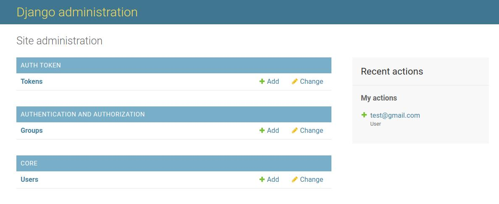
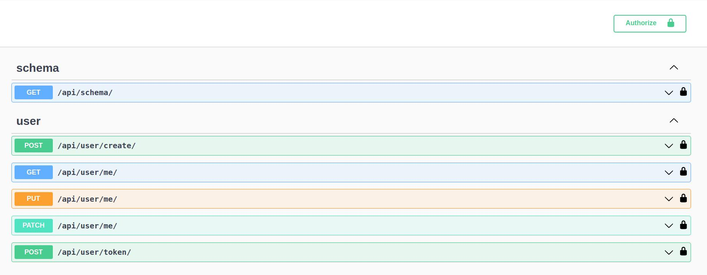
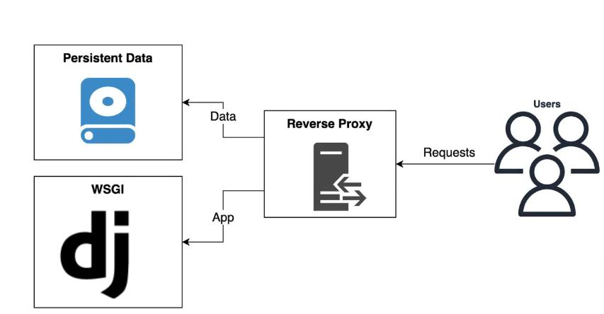
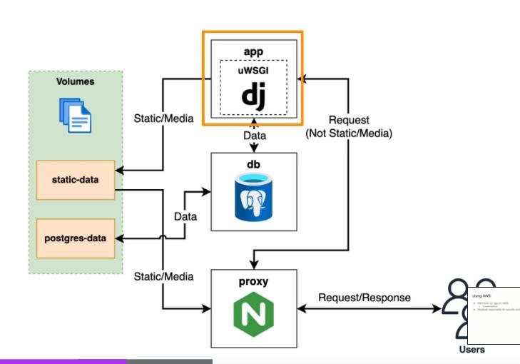

# Django Template 

When you want to start a new Django project, 
this template is for you.

It has Token authentication for user, 
User API, user app and core app.

Just create a new repository from this template, 
and you will have a basic Django project
with two applications inside:
- core
- user

to manage the basic things every Django projects should have, 
like Wait for db task, and the basi User management.

Swagger is also setted up

